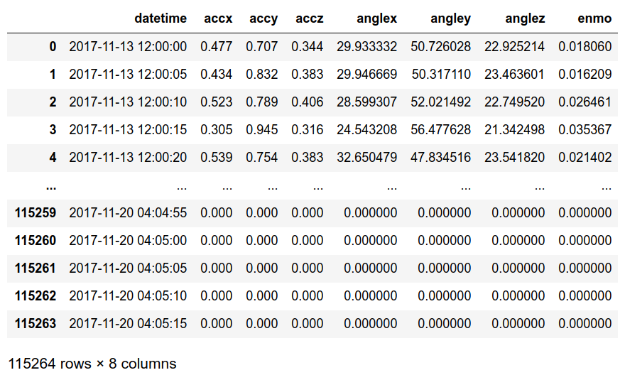

Python implementation of the GGIR R-package for processing wearable accelerometer data

## Support

is limited to these features:

 * Loading Actigraph CSV-data,
 * Calculating angles and ENMO for time windows (of typically 5 seconds)
 * Batched processing for memory and compute efficiency

These are in part1 of GGIR, however calibration w.r.t. scale and offet errors, other data formats, other metrics and
wear detection are not implemented.

## Setup

    pip3 install git+https://github.com/prinsherbert/girrgorr.git

## Use:

    from girrgorr import get_metrics

    filename = 'actigraph_result.csv'
    window_size = 5 # seconds

    metrics = get_metrics(
        filename,
        window_size=window_size,
        progressbar=True,
        metrics=['angles', 'enmo'])

## Result

 * `accx`, `accy` and `accz` are the first raw accelerations of each window, they are there only for debugging.
 * `datetime` is the first timestamp of the window

